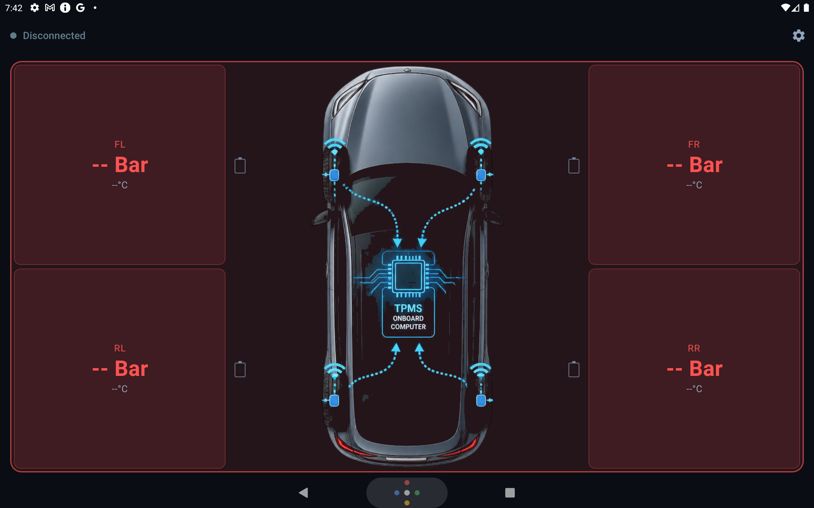

# TPMS Monitor

Android app for continuous tire pressure monitoring via generic USB TPMS dongles. Runs as a foreground service, supports home-screen widgets, and includes optional integration for [Teyes](https://teyes.cc/) car head units (CC3 and similar).



[](https://github.com/drrhaos/tpms/actions/workflows/ci.yml)

> Replace `drrhaos/tpms` in the badge URL after creating the GitHub repository.

## Features

- **USB dongle support** — HID, Serial `0x55AA`, and Deelife / MU7J protocols (auto-detected)
- **Background monitoring** — foreground service with reconnect on USB detach, boot auto-start, and liveness checks
- **Alerts** — low/high pressure, high temperature, low sensor battery, signal lost
- **Widgets** — dashboard and compact home-screen widgets (when the launcher supports pinning)
- **History** — local Room database for sensor readings
- **Diagnostics** — export logs and settings for troubleshooting
- **Teyes integration** — extended onboarding, FrontApp launcher widgets, wake escalation, and USB sleep recovery

## Requirements

| | |
|---|---|
| Android | 9+ (API 28) |
| Hardware | USB host port + TPMS USB dongle |
| Permissions | USB, notifications, foreground service; optional overlay for floating dashboard |

## Supported dongles

The app auto-detects common TPMS receivers:

- USB HID class devices
- CH340 / CP2102 / CH9102 serial adapters (CDC or vendor class)
- Protocols: **USB HID**, **Serial 0x55AA**, **Deelife / MU7J**

If you have multiple USB devices connected, set the preferred dongle VID:PID in Settings.

## Install

### From GitHub Releases

1. Download `tpms_v.X.Y.Z.apk` (or `tpms_v.X.Y.Z-unsigned.apk` if the release was built without signing secrets) from [Releases](https://github.com/drrhaos/tpms/releases).
2. Enable **Install unknown apps** for your file manager or browser.
3. Open the APK and install.
4. Connect the TPMS dongle via USB OTG and complete the in-app onboarding.

### Build from source

```bash
git clone https://github.com/drrhaos/tpms.git
cd tpms
./gradlew :app:assembleDebug
adb install -r app/build/outputs/apk/debug/app-debug.apk
```

Release APK (unsigned, for local signing):

```bash
./gradlew :app:assembleRelease
# output: app/build/outputs/apk/release/app-release-unsigned.apk
```

## Teyes head units

On Teyes CC3 and similar FYT-based units:

1. Enable **auto-start** for TPMS Monitor in system settings.
2. Disable **battery optimization** for the app.
3. Lock the app in **recent apps**.
4. For a launcher widget, install [FrontApp for Teyes](https://play.google.com/store/apps/details?id=ru.fytmods.frontapp) and add TPMS Monitor from there (stock ZLink launcher often cannot pin widgets).

The app detects Teyes hardware automatically and shows extra setup steps in onboarding and Settings.

## Signing a release APK

For local or CI-signed releases, copy the example keystore config:

```bash
cp keystore.properties.example keystore.properties
# edit keystore.properties with your keystore path and passwords
./gradlew :app:assembleRelease
```

For GitHub Actions signed releases, configure these repository secrets:

| Secret | Description |
|--------|-------------|
| `KEYSTORE_BASE64` | Base64-encoded `.jks` / `.keystore` file |
| `KEYSTORE_PASSWORD` | Keystore password |
| `KEY_ALIAS` | Key alias |
| `KEY_PASSWORD` | Key password |

Without secrets, the release workflow still publishes an **unsigned** APK suitable for sideloading after manual signing.

## Creating a release

1. Bump `versionCode` / `versionName` in `app/build.gradle.kts` (or pass `-PversionName=` / `-PversionCode=` to Gradle).
2. Commit and push.
3. Tag and push:

```bash
git tag v1.0.0
git push origin v1.0.0
```

The [Release workflow](.github/workflows/release.yml) builds the APK and attaches it to the GitHub Release.

## Development

```bash
./gradlew :app:testDebugUnitTest   # unit tests
./gradlew :app:lintDebug            # lint
./gradlew :app:assembleDebug        # debug APK
```

Key source paths: `service/TpmsMonitorService.kt`, `data/usb/TpmsProtocolRouter.kt`, `data/repository/TpmsRepository.kt`, `ui/onboarding/OnboardingScreen.kt`.

### USB debugging

```bash
adb shell dumpsys usb
adb logcat -s TPMS_HID TPMS_RAW TPMS_WIDGET WakeEscalation
```

### Teyes emulator profile

See [tools/README.md](tools/README.md) for an AVD profile that approximates a Teyes CC3 head unit.

## License

MIT — see [LICENSE](LICENSE).
